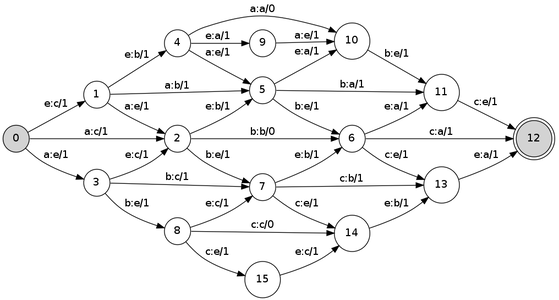

fslib
=====

Finite state transducer library. Minimalistic pure C implementation. This project is mostly inspired by OpenFST library (http://www.openfst.org) by Michael Riley and Mehriar Mohri. The main focus here is a performance and simplicity. 

The package could be used to construct n-gram language models and as a construction block for decoders in speech recognition and spelling correction. It could be used for the tasks of discrete optimization on sequences (e.g. levenstein distance).



Basic operations
-----

### Compilation

Let's create an automaton that accepts "(01)\*" regular language.

```bash
echo  "\
0 1 0 0
1 0 1 1
0" | fscompile > automaton.t
```

Each line contains either transition or final state.

Transition line format:
* source state
* destination state
* input label
* output labe
* (optional) weight

Final state line contains only a number of a state.

### Composition

### Shortest path

### Printing

### Drawing

### Automaton stats

